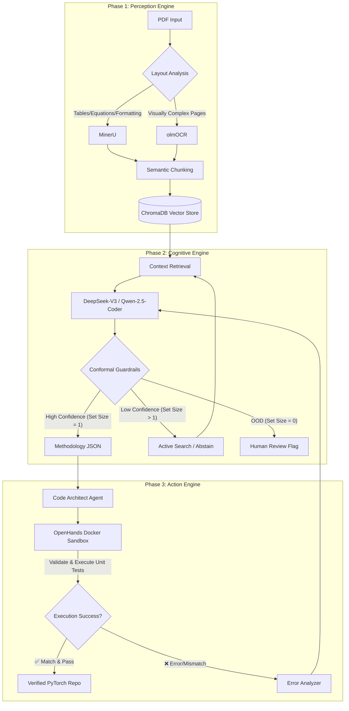

# Multi-Agent Architecture (GenAI Upgrade)

This document describes the upgraded **Multi-Agent Architecture** for **Research2Code-GenAI**, reflecting the transition to a **Conformal Generative Vision-Language Framework** for Autonomous Scientific Reproduction.

The framework moves beyond simple multi-agent pipelining to an autonomous **Perception-Cognition-Action** loop with embedded conformal prediction to guarantee structured coverage and prevent hallucinations.

## Architecture Overview

The system is orchestrated into three primary engines:

### 1. Perception Engine
Responsible for high-fidelity visual and semantic extraction from unstructured PDFs, addressing the modality gap between academic papers and structured code.
*   **MinerU Subsystem:** The primary parser that translates PDFs into structured JSON while preserving crucial LaTeX equations, tables, and document layout semantics.
*   **olmOCR Fallback Subsystem:** Triggered for visually complex pages where heuristic parsing fails, utilizing fine-tuned Vision-Language Models for deep visual reading.
*   **Semantic Chunking & Vector Store:** The extracted text, equations, and structures are semantically chunked and stored in **ChromaDB** for efficient retrieval.

### 2. Cognitive Engine
The "brain" of the architecture, where information is analyzed, reasoned upon, and evaluated for uncertainty before code is generated.
*   **Local LLM Reasoning:** Powered by robust local models (e.g., DeepSeek-V3, Qwen-2.5-Coder) to analyze the method structure and mathematical formulations.
*   **Hierarchical Conformal Prediction Guardrails:** An embedded conformal scoring mechanism quantifies uncertainty at the token, field, and document levels. 
    *   **High Confidence:** The system commits the extracted parameter or architectural detail.
    *   **Uncertain/Low Confidence (Size > 1):** The system abstains and triggers an Active Search (e.g., querying the appendix or references).
    *   **Out of Distribution (Size = 0):** Flags the extraction for human review.
*   **Geometry-Aware Nonconformity Scoring:** Fuses visual layout, reading order, and semantic embeddings to construct region-sensitive nonconformity scores, moving away from simple post-hoc Monte Carlo dropout techniques.

### 3. Action Engine
The execution layer that actively generates, attempts to run, and autonomously corrects the scientific implementation.
*   **Code Architect Agent (OpenHands Integration):** Synthesizes the full PyTorch repository (model architectures, training loops, dataset loaders) based on the highly-confident extractions from the Cognitive Engine.
*   **Docker Sandbox Execution:** Safely executes the generated code and unit tests in an isolated Docker environment.
*   **Self-Healing Verification Loop:** 
    *   If execution produces a runtime error or metric mismatch, the **Error Analyzer** feeds the exact trace and discrepancies back to the Cognitive Engine.
    *   The Cognitive Engine reprompts the Code Architect to patch the specific layers or implementation details, iterating until the tests pass and findings match the paper.

## End-to-End Workflow Diagram

## Hardware and Training Efficiency
The conformal generative models and cognitive layers are optimized for localized execution on single consumer-grade or workstation GPUs (e.g., NVIDIA RTX 3090/4090, RTX 5050), utilizing parameter-efficient adaptation strategies like LoRA, layer-wise scaling, and low-rank visual adapters.

## Key Novelties in the Upgraded Architecture
1. **OCR-Free Generative Document Extraction:** Bypasses error-prone traditional OCR pipelines in favor of MinerU and olmOCR, preserving visual-spatial integrity.
2. **Abstention-Aware Decoding:** Unlike standard agents that hallucinate details when unsure, the Cognitive Engine will actively abstain and request more retrieval when confidence falls below the calibrated conformal threshold.
3. **Closed-Loop Execution:** OpenHands autonomously writes tests against the paper's claimed mathematical constraints and ensures the generated model code actually builds and trains before concluding the task.
