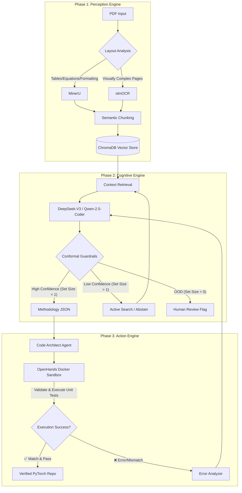

# 📚 Research2Text - Complete Technical Documentation

> **A Deep Dive Into the Conformal Generative Vision-Language Framework for Autonomous Scientific Reproduction**

This document provides an exhaustive technical explanation of the upgraded **Research2Code-GenAI** project. By transitioning from a standard Multi-Agent RAG pipeline to an autonomous, uncertainty-aware **Perception-Cognition-Action** loop, the system resolves critical hallucination and modality gap issues. Every component is explained with the "how" and "why" behind its implementation.

---

## 📋 Table of Contents

1. [System Overview](#system-overview)
2. [Perception Engine: Visual Parsing](#perception-engine-visual-parsing)
3. [Cognitive Engine: Conformal Prediction](#cognitive-engine-conformal-prediction)
4. [Action Engine: Autonomous Execution](#action-engine-autonomous-execution)
5. [Data Structures and Schemas](#data-structures-and-schemas)
6. [Algorithms and Mathematical Foundations](#algorithms-and-mathematical-foundations)
7. [Hardware and Performance Considerations](#hardware-and-performance-considerations)
8. [Error Handling and Edge Cases](#error-handling-and-edge-cases)
9. [Future Architecture Considerations](#future-architecture-considerations)

---

## 1. System Overview

### 🎯 Project Philosophy

Research2Code-GenAI is built on three core properties to address the reproducibility crisis in machine learning research:

1. **Modality Preservation**: Scientific literature uses deep layouts (equations, tables, graphs). Traditional OCR strips this, expanding the modality gap. Our system replaces text-only extraction with spatial and visual parsing.
2. **Strict Uncertainty Quantification (Conformal Prediction)**: LLMs naturally hallucinate missing hyperparameters. This system implements mathematical coverage guarantees that force the agent to **abstain** rather than guess.
3. **Closed-Loop Verification**: Generation without execution is simply autocomplete. We embed sandboxed autonomous agents to iteratively verify code correctness.

### 🏗️ High-Level Architecture


```mermaid
graph TD
    subgraph "Phase 1: Perception Engine"
        A[PDF Input] --> B{Layout Analysis}
        B -- Tables/Equations/Formatting --> C[MinerU]
        B -- Visually Complex Pages --> D[olmOCR]
        C & D --> E[Semantic Chunking]
        E --> F[(ChromaDB Vector Store)]
    end

    subgraph "Phase 2: Cognitive Engine"
        F --> G[Context Retrieval]
        G --> H[DeepSeek-V3 / Qwen-2.5-Coder]
        H --> I{Conformal Guardrails}
        I -- High Confidence (Set Size = 1) --> J[Methodology JSON]
        I -- Low Confidence (Set Size > 1) --> K[Active Search / Abstain]
        I -- OOD (Set Size = 0) --> L[Human Review Flag]
        K --> G
    end

    subgraph "Phase 3: Action Engine"
        J --> M[Code Architect Agent]
        M --> N[OpenHands Docker Sandbox]
        N -- Validate & Execute Unit Tests --> O{Execution Success?}
        O -- ✅ Match & Pass --> P[Verified PyTorch Repo]
        O -- ❌ Error/Mismatch --> Q[Error Analyzer]
        Q --> H
    end
```

---

## 2. Perception Engine: Visual Parsing

### Why MinerU and olmOCR?

Previously, the pipeline utilized PyMuPDF which effectively destroyed mathematical formulas, tables, and multi-column semantic context.

*   **MinerU**: Provides high-fidelity visual PDF parsing. It extracts mathematical expressions into accurate LaTeX and understands structured content visually.
*   **olmOCR**: Acts as a robust fallback for heavily distorted or visually complex pages where deterministic parsing fails, using fine-tuned VLMs to reconstruct the page structure.

### Implementation Details

**1. Vision Representation:** The OCR-free vision encoder (using a small ViT/Swin architecture) operates directly on document images, generating dense visual patches. It handles single and multi-page documents via page-wise encoding coupled with learned page-position embeddings.
**2. Semantic Chunking**: The rich Markdown/LaTeX output from the perception tools is mapped into 700-word chunks (100-word overlap) optimized to encapsulate entire mathematical proofs or method sections without arbitrary breakage.
**3. Vector Storage**: The chunks are embedded using `sentence-transformers/all-MiniLM-L6-v2` and efficiently searched using locally-hosted ChromaDB with an HNSW index, utilizing Cosine Similarity metrics.

---

## 3. Cognitive Engine: Conformal Prediction

### The Hallucination Problem

Standard LLMs generate code successfully but silently invent missing architectures or hyperparameters not explicitly detailed in the paper.

### Our Solution: Hierarchical Conformal Prediction

Instead of bolting Monte Carlo Dropout or heuristic soft-max tracking onto the pipeline, the framework embeds token and field-level conformal prediction directly into the generative decoder.

#### The Decoding Process
1. **Geometry-Aware Scoring:** The context isn't just flat text. A multi-modal nonconformity score fuses visual layout (bounding boxes), spatial structure, and semantic context.
2. **Prediction Sets:** For each extracted entity (e.g., Learning Rate, Model Depth, Layer Type), the conformal layer outputs a *prediction set* rather than a single point estimate.
3. **Abstention Policy:**
    *   **Set Size = 1:** The model is absolutely confident. Output is committed.
    *   **Set Size > 1:** The model is uncertain about the exact parameter (e.g., {0.01, 0.001, 0.0001}). It triggers an **Active Search** to re-query ChromaDB or abstains, avoiding hallucination.
    *   **Set Size = 0:** Out of Distribution anomaly—flags for human review.

#### Differentiable Surrogate Coverage Loss
During fine-tuning, calibation quality is evaluated via a surrogate coverage loss ($L_{cov}$), encouraging conformal nonconformity scores to align with desired coverage goals natively in the loss landscape.

---

## 4. Action Engine: Autonomous Execution

### The Verification Problem

Generated code frequently suffers from semantic bugs, un-imported packages, or shape mismatches that only surface at runtime.

### Our Solution: OpenHands & Self-Healing

1. **Code Architect Integration:** Structured JSON schemas extracted from the Cognitive Engine are passed to the Code Architect.
2. **Execution Sandbox:** The system hooks into **OpenHands** to spin up an isolated Docker Sandbox containing a fresh Python interpreter and necessary PyTorch dependencies.
3. **Execution Loop:**
   *   The agent stages `model.py`, `train.py`, and `dataset.py`.
   *   Runs an autonomous unit test suite to check output shapes, parameter counts, and API compatibility.
   *   **Self-Healing:** If execution fails (e.g., `RuntimeError: Shape Mismatch`), the Error Analyzer strips the stderr trace and feeds it back into the Cognitive Engine with the current code, prompting the LLM to patch exactly what failed.
   *   Verification continues iteratively for a bounded number of attempts to prevent infinite stalling.

---

## 5. Data Structures and Schemas

Using Pydantic, the system guarantees strong runtime typing for bridging the LLM output with the Python execution layer. By structuring responses strictly, we eliminate syntax/parsing breakages downstream.

```python
from pydantic import BaseModel, Field

class MethodStruct(BaseModel):
    algorithm_name: Optional[str] = Field(default=None)
    equations: List[str] = Field(default_factory=list)
    datasets: List[str] = Field(default_factory=list)
    training: TrainingConfig = Field(default_factory=TrainingConfig)
    # The Conformal Confidence Scores
    confidence_scores: Dict[str, float] = Field(default_factory=dict)
```

**Schema Philosophy:**
*   Optional fields permit graceful degradation when the Conformal Engine intentionally abstains.
*   Enforces modularity, allowing code generators to apply intelligent defaults or fallbacks only for fields explicitly marked as undetermined.

---

## 6. Algorithms and Mathematical Foundations

### Loss Function Objective ($L_{total}$)

Let $y$ be the structured sequence, $\hat{y}$ the model output, $s(\cdot)$ the nonconformity scores, and $q_\alpha$ the empirical calibration quantile.

The framework optimizes a weighted joint objective during its fine-tuning configuration:

$$ L_{total} = L_{gen} + \lambda_{conf} L_{conf} + \lambda_{cov} L_{cov} + \lambda_{size} L_{size} $$

*   **$L_{gen}$**: Standard Negative Log-Likelihood (sequence likelihood).
*   **$L_{conf}$**: Conformal Score Regularization minimizing distance between empirical outputs and target bounds.
*   **$L_{cov}$**: Differentiable surrogate approximation driving strict threshold guarantees across token, field, and document levels.
*   **$L_{size}$**: Set-size penalty ensuring the model doesn't cheat by producing infinitely broad prediction sets.

---

## 7. Hardware and Performance Considerations

### Single-GPU Efficiency
Deploying large generative models locally is computationally intensive. Our architecture is heavily modified to run completely locally on a single consumer GPU (e.g., RTX 3090/4090 or RTX 5050).

*   **Parameter-Efficient Fine-Tuning (PEFT):** Utilizes Low-Rank Adaptation (LoRA) matrices on attention and feed-forward layers.
*   **Memory Management:** Implements gradient checkpointing, Mixed Precision Training (FP16/BF16), and heavy gradient accumulation (effective batch sizes of 16-32) to prevent OOM errors.

---

## 8. Error Handling and Edge Cases

### Recovery Strategies
*   **Missing Paper Fields:** Driven by conformal predictions abstaining, the code generator emits PyTorch modules configured dynamically to accept flexible input sizes (e.g. `LazyLinear` or generalized dummy data logic) allowing tests to run regardless.
*   **Corrupted Documents:** If MinerU fails completely on PDF ingestion, olmOCR engages directly against rasterized images of the page.
*   **Infinite Self-Healing Loops:** Bounded retry constraints in OpenHands force the process to halt after $N$ failed validation cycles, emitting the final broken state along with its trace for manual oversight.

---

## 9. Future Architecture Considerations

1. **Multi-Paper Synthesis:** Extending the RAG context and Cognitive Engine to synthesize code by combining insights spanning *multiple* reference papers instead of isolated executions.
2. **Deep Code Tracing:** Moving beyond regex error capturing in the sandbox execution step by integrating semantic AST validation directly with the Cognitive trace logging.
3. **Advanced Abstention Policies:** Integrating explicit reinforcement learning into the abstention-aware policy function to balance uᴛiʟiᴛy functions mapping F1 scores against rigid coverage constraints dynamically.
